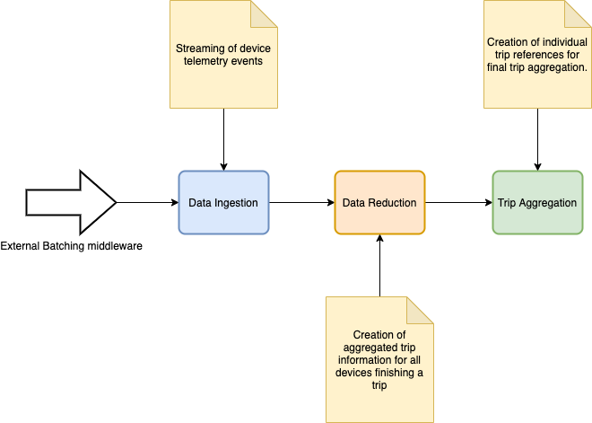
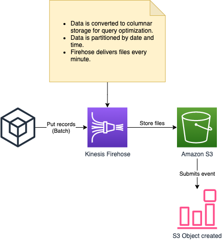
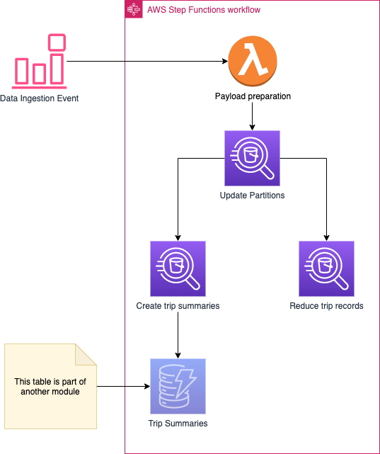
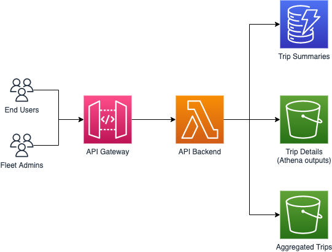

**DISCLAIMER: This repository is work in progress. Its contents may change while this disclaimer is present.**

# Trip aggregation sample

Welcome! This repository contains an infrastructure and code sample for the creation of a trip aggregation system to unify telemetry from your different devices as each of their journeys finish. It's purposed to _moving things_ - e.g. cars, freights, mobile phones - although this infrastructure would suit you too for non-moving devices that are used on a session-basis - e.g. drills, industrial machinery, etcetera.

_NOTE: The architecture of this repository uses general-purpose data streaming and aggregation techniques, which provides a cost-effective approach for batch data ingestion and processing, that can be helpful when the initial telemetry transmission channels are already set - outside of the scope of this repository's content. Some middleware shall be used for ultimate ingestion. For solutions where the devices are new in the field, where their firmware could be easily modified, or when no middleware ingestion batching mechanism is available, an [AWS Iot](https://aws.amazon.com/iot-core/) ingestion channel is recommended._

## What is this sample?

This sample solution attempts to help AWS customers design data ingestion flows to empower their connected devices to transmit telemetry information when they're used; and integration means to aggregate device information in _trips_ once they stop being used. It is particularly useful when your solution requires for several information providers to ingest data, potentially through batch requests, and/or where the firmware of the data producers cannot be altered, and information shall be relayed through existing channels.

## Getting started

The architecture for this sample is built using the [AWS Cloud Development Kit](https://docs.aws.amazon.com/cdk/v2/guide/home.html), and the whole codebase is built using Typescript. You will need to have `npm` installed to successfully launch this sample. You will also need to have the AWS CLI installed and configured.

### Preparing the environment

* Install the AWS CDK in your machine: `npm install -g aws-cdk-lib`.
* Install the typescript node runner: `npm install -g ts-node`.
* Clone this repository and navigate to its root folder.
* Install dependencies for the project: `npm install`. This will automatically trigger the installation procedure of all packages in the repository.

### Building and delivering the project

We will be using the CDK directly in Typescript, so there's no need to transpile the infrastructure definition for its utilization. However, the project contains source code for several Lambda functions, **and this code needs to be transpiled to JavaScript** so the Lambda runtime understands it. To build all code for the functions, and get your environment ready for a CDK deploy, run `npm run pre:deploy` in the root folder of the project.

Once the code is successfully built, the project is ready for cloud deployment. Simply type `cdk deploy` and respond to any prompt given by the CDK. Deployment should take up to a few minutes, and once finished the solution would be ready to use.

### Using the device simulator

This sample bundles a tiny device simulator, whose purpose is to create dummy data loads that are ingested in the system, so the sample can be tested through immediately. This simulator can - and should - be replaced with more complex simulation features that would resemble your workload requirements closer.

_NOTE: Depending on the settings you configure for the device simulator, the software can create and transmit huge data structures through your network, which may throttle other networking activities in restricted connectivity environments. For tests using large workloads or high-scale throughput, it is advised to run the simulator from a cloud location - e.g. an EC2 instance or a Cloud9 environment._

Go to the `packages/vehicle-simulator` package and open the `index.ts` file. Configure the simulation parameters:

```ts
console.log('INFO: Starting simulation engine');
const TargetVehicles = 100; // How many devices will concur in the field
const TargetTripDuration = 1800; // Average duration of trips. The simulator adds a deviation of 20% from this value
```

Run the simulation with `ts-node index.ts`.

#### Configuring the simulation data

The device simulator uses very simple records to be ingested. This works for running a basic simulation on the architecture and process, but usually its more helpful to tailor the simulation data to the needs of the use case. To tune the simulator to the needs, you'd need to modify two files:

* `records.ts` file, which defines the interface that all event records must comply with.
* `generator.ts` file governs the simulation and is responsible for generating records, randomizing values, and submitting them.

_NOTE: Part of the properties used in the sample simulation interface - e.g. `TripId` - are also used by the infrastructure for partitioning, query execution, and trip aggregation. Modifying the keys of the data contracts would require modifications on the infrastructure for the sample to continue working correctly._

## Architecture



The architecture for this project is split into several modules, each of which focuses on handling a discrete part of the aggregation process. These are the available modules and a brief summary of their scope:

* [**Data ingestion**](#ingesting-data): Data ingestion focuses on the reception of incoming telemetry events from all active devices, and its storage for posterior analysis.
* **Data reduction**: As devices finish their trips, this module handles the unification of all telemetry information from all finished trips in a given time span, and the storage of each trip records reduced by trip.
* **Trip aggregation**: This module is responsible for individualizing each finished trip, creating trip references that can be queried by device users or fleet managers.

The full infrastructure for this project is Serverless, and based on AWS managed services. The operational overhead for managing this architecture should be minimal.

Apart from these modules, an extra one is provided for simulating events coming through the system. [This module](/packages/vehicle-simulator/README.md) creates dummy events for the given number of vehicles, so the system can be tested with simulated data.

### Ingesting data

This module is responsible for the ingestion of raw telemetry information into the system. Ingested data is stored for further analysis, partitioned by the time each event was transmitted.



As devices enter the field and start transmitting records through their configured channels, these events can be relayed to the ingestion module so information is properly partitioned and stored. Partitioned data helps narrowing down further querying processes and optimize the consumption of resources for this and other architecture modules. This module also takes care of data transformation into columnar storage, for further optimization. This module is powered by [Amazon Kinesis Firehose](https://aws.amazon.com/kinesis/data-firehose/).

Firehose will deliver a file containing all incoming records every _one minute_ - this number is configurable to tailor this sample to your needs. Every time Firehose delivers a new file with records, a CloudWatch event is sent, that helps other modules automate their processing.

### Reducing data

As vehicles progress through their journey, they're continuously transmitting telemetry records, that the [data ingestion](#ingesting-data) module has stored in several files, according to the configured batch settings for the module. These files contain telemetry records for all active devices in a given time span, and this module is responsible for reducing these data into unified trip records that can be queried and analysed individually using other modules.



This module is based on an orchestrated process, governed by [AWS Step Functions](https://aws.amazon.com/step-functions/). Upon a new file being delivered by the [data ingestion](#ingesting-data) module, this process is launched, and automatically performs the reduction of all target trips each time.

As vehicles are involved in active trips, data is being continuously ingested. This module only cares for finished trips, and it is only after a _TRIP-FINISHED_ event is submitted - and thence a part of a telemetry records file - when this module targets such trip for further analysis. This filtering process helps optimizing resources by disregarding ongoing events and only analyzing trips once, after they're finished.

This module leverages [Amazon Athena](https://aws.amazon.com/athena) for unifying trip records and generating the reduced outcome. Upon each new file delivered, the orchestration of this process is as follows:

* The data for the configured Athena Table is updated, so all potential new partitions are taken into account. This is a necessary step as data is queried continuously as new records are stored.
* The system executes two queries in parallel, to generate the reduced outcomes with all trip information:
  * A trip summary record is generated. This summary contains general information about the trip, such as duration, telemetry record availability, and so on. This information will be used later on for querying trip information.
  * A _finished trips_ file is generated, containing reduced records for all trips finished in the given time span. These records are stored together in one file, as the query output from Amazon Athena.

After Athena has executed all queries and produced the outcomes, the system should've successfully identified all finished trips in that time frame, and stored all their reduced information, and trip summaries. This data is thereafter recorded in a [Amazon DynamoDB](https://aws.amazon.com/dynamodb) table, including trip summary information, and a reference to the file containing the reduced records for each trip. This table is part of the [Trip Aggregation module](#aggregating-trips), documented below.

### Aggregating trips

As the [Data Reduction module](#reducing-data) outputs information on finished trips summary and details, each trip summary record is automatically stored in a DynamoDB table for further usage. This record contains summary data of the trip - e.g. identifiers, duration, anomalies, etcetera - along with a reference to the file - located in S3 - containing the details of such trip. This module exposes the trip information through an API, enabling fleet managers and device owners to seamlessly get information of their trips.



The [Data reduction module](#reducing-data) has successfully generated trip summaries for all finished trips, which have been automatically stored in the domains of this module. The details of each trip, however, is not stored individually, but rather put in one file containing all records for all finished trips in each query execution. This file is referenced in the trip summary, to help further processes know where to find the records for each particular trip.

This module introduces a new storage bucket, purposed to store final, individual information of each trip, so further access is easier and doesn't involve reading a - potentially huge - reduced trip file containing records for thousands of other trips. To reduce spikes and potential throttles on trip aggregation, this individualization activity is executed on demand, on the fly:

* The first time that an end user or fleet manager requests the details of a trip, the _reduced trip_ file is queried, retrieving all records relating to such trip. The [Amazon S3 Select](https://aws.amazon.com/blogs/aws/s3-glacier-select/) feature is used to query the file, only fetching interesting data for each request. The output of this query is stored in the trip aggregation bucket.
* As the first run of the process has produced an output containing the aggregated trip, subsequent requests for such trip would directly fetch and return the information contained in such file, avoiding querying bulky files every time a request is made, and optimizing the resources consumed for each one.
* 
## Security

See [CONTRIBUTING](CONTRIBUTING.md#security-issue-notifications) for more information.

## License

This library is licensed under the MIT-0 License. See the LICENSE file.
